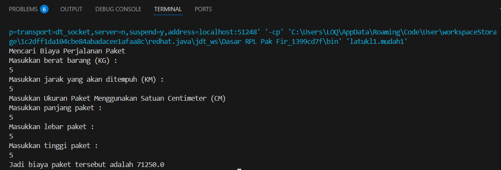
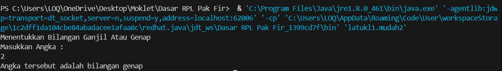
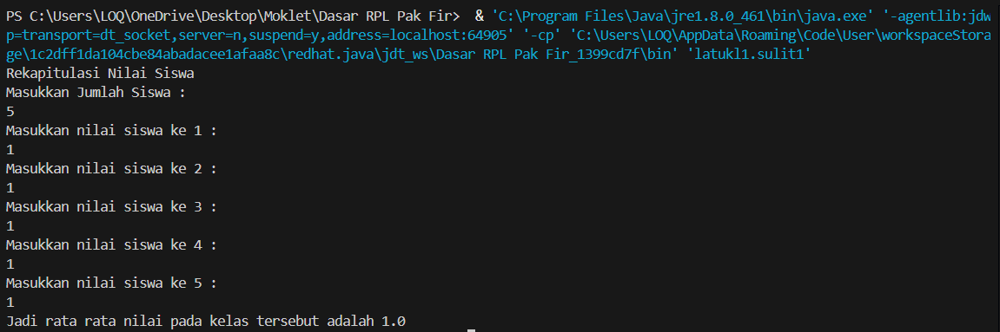
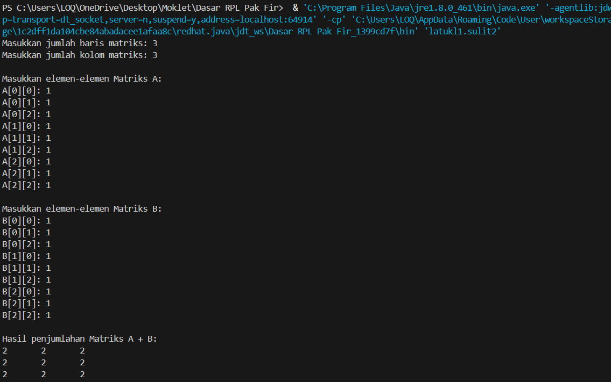

SOAL 1 -- Mudah

### 1️⃣ Menghitung Biaya Pengiriman Barang

Fungsi Program:
Menghitung total biaya pengiriman berdasarkan berat, jarak tempuh, dan
volume paket.

Cara Kerja Program:
1. Input panjang, lebar, tinggi, berat, dan
jarak paket.
2. Hitung volume: `volume = panjang * lebar * tinggi`
3. Tentukan biaya per kg berdasarkan jarak:
- ≤ 10 km → Rp 4.250/kg
- \> 10 km → Rp 6.000/kg
4. Tambahkan biaya tambahan Rp 50.000 jika volume \> 100 cm³
5. Hitung total biaya dan tampilkan hasil.

📸 Screenshot Output:

------------------------------------------------------------------------

### 2️⃣ Menentukan Bilangan Ganjil atau Genap

Fungsi Program:
Menentukan apakah bilangan yang dimasukkan adalah ganjil atau genap.

Cara Kerja Program: 
1. Input bilangan dari pengguna.
2. Gunakan operator modulus `%` untuk menentukan sisa bagi 2.
3. Jika sisa 0 → genap, jika tidak → ganjil.

📸 Screenshot Output:

------------------------------------------------------------------------

SOAL 2 -- Sedang

### 3️⃣ Menghitung Faktorial

Fungsi Program:
Menghitung nilai faktorial dari bilangan bulat positif.

Cara Kerja Program:
1. Input bilangan `n`.
2. Gunakan perulangan `for` untuk menghitung `n!`.
3. Tampilkan hasil faktorial.

📸 Screenshot Output:

------------------------------------------------------------------------

### 4️⃣ Menghitung Volume Tabung (Dengan Fungsi)

Fungsi Program:
Menghitung volume tabung menggunakan fungsi dengan parameter.

Cara Kerja Program:
1. Gunakan rumus `V = π * r * r * t`.
2. Buat fungsi `hitungVolume(double r, double t)`.
3. Panggil fungsi di `main()` untuk menampilkan hasil.

📸 Screenshot Output:

------------------------------------------------------------------------

SOAL 3 -- Sulit

### 5️⃣ Menghitung Rata-rata Nilai Siswa

Fungsi Program:
Menghitung rata-rata nilai ujian dari sejumlah siswa.

Cara Kerja Program:
1. Input jumlah siswa.
2. Gunakan perulangan untuk input nilai tiap siswa.
3. Jumlahkan semua nilai dan bagi dengan jumlah siswa.

📸 Screenshot Output:

------------------------------------------------------------------------

### 6️⃣ Penjumlahan Dua Matriks

Fungsi Program:
Menjumlahkan dua buah matriks berukuran sama.

Cara Kerja Program:
1. Input ukuran (baris, kolom).
2. Input elemen matriks A dan B.
3. Tambahkan elemen A\[i\]\[j\] + B\[i\]\[j\] dan simpan ke matriks
hasil.\
4. Cetak hasil penjumlahan.

📸 Screenshot Output:

------------------------------------------------------------------------

📝 **Disusun oleh:**\
Aditya Rahman / X RPL 2 / 02\

